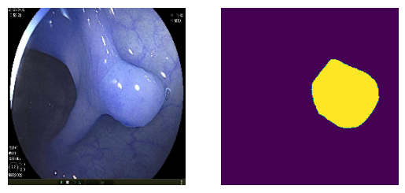

## Dataset

https://www.kaggle.com/competitions/bkai-igh-neopolyp



## Training

```bash
source ./bash_sh/train_resunet.sh
```

## Testing

```bash
python -m src/infer.py --model [CHECKPOINT_PATH] --data_path [DATA_PATH] --save_path [SAVE_PATH]
```

## Checkpoint
Link to model https://www.kaggle.com/datasets/pqnhoang/model-unet

